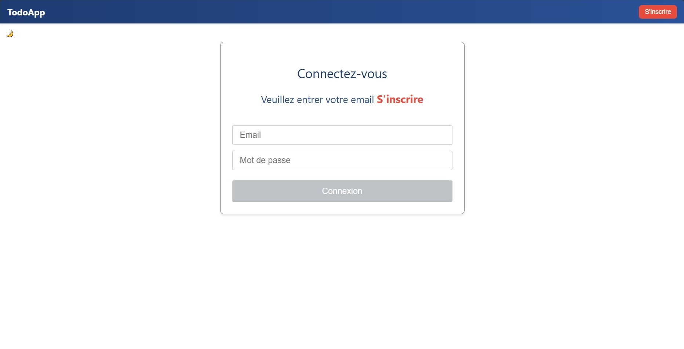

# TodoApp – Gestionnaire de tâches moderne

TodoApp est une application web moderne et intuitive pour gérer facilement vos tâches quotidiennes. Développée avec Angular pour offrir une expérience fluide et responsive sur tous les appareils.

---

## Fonctionnalités clés

- Authentification sécurisée (JWT)
- CRUD complet des tâches (ajout, modification, suppression)
- Interface responsive (mobile, tablette, desktop)
- Routes protégées avec Angular Guards

---

## Technologies utilisées

- **Angular 17** (Standalone Components)
- **Reactive Forms** 
- **RxJS**
- **JWT Authentication** 
- **Jasmine & Karma** pour tests unitaires

---

## Démo en ligne

[Accédez à l'application sur GitHub Pages](https://smaail-hennani.github.io/todoApp/login)

---

## Installation rapide

```bash
git clone https://github.com/smaail-hennani/todoApp.git
cd todoApp
npm install
ng serve
```

Accédez ensuite à l'application à l'adresse suivante : [http://localhost:4200](http://localhost:4200)

---

## Lancer les tests unitaires

```bash
ng test
```

---

## Capture d'écran

L'icône 🌙 en haut à gauche permet de basculer vers le mode sombre :



## Voir aussi
- **Backend associé (API Node.js) :**
[API Backend sur Scalingo](https://todosecure-api.osc-fr1.scalingo.io) | [Code source backend](https://github.com/smaailhennani-cloud/TodoSecure-API)  

## Contact
**Smaail** – Développeur Angular & Node.js Fullstack
- Email : smaail.hennani@gmail.com
- LinkedIn : www.linkedin.com/in/smaail-hennani-3a0494117


Accédez ensuite à l'application à l'adresse suivante : [http://localhost:4200](http://localhost:4200)

Merci pour votre visite !

## Licence
Ce projet est disponible sous licence MIT. Voir le fichier LICENSE pour plus d'informations.
